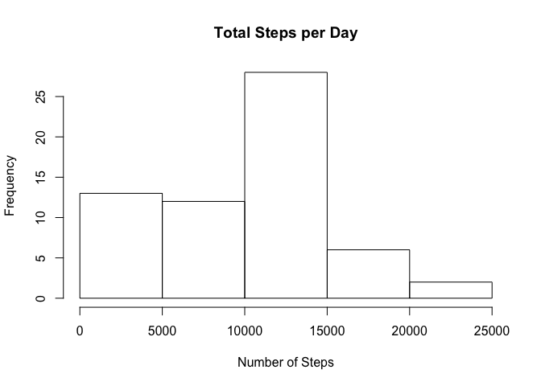
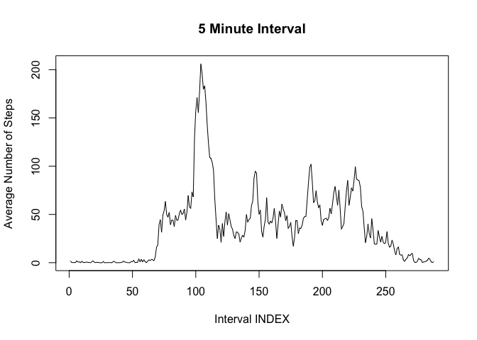
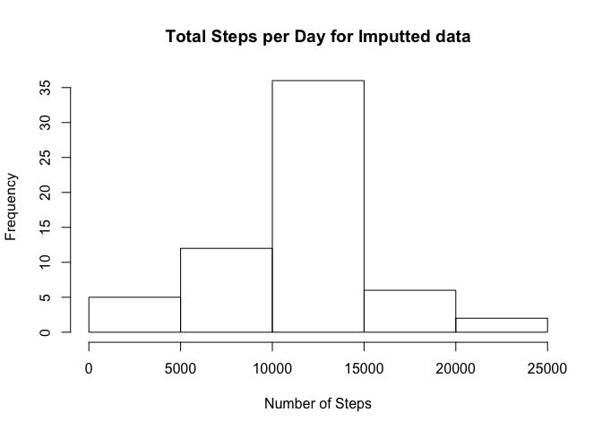
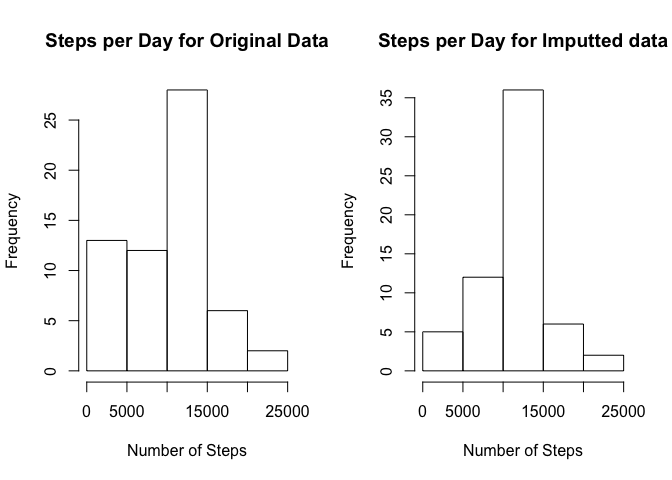

# Reproducible Research: Peer Assessment 1


## Loading and preprocessing the data
Read in the activity data

```r
activity <- read.csv(unz("activity.zip", "activity.csv"))
```

## What is mean total number of steps taken per day?
Calculate steps by day.

```r
bydate <- split(activity$steps, activity$date)
stepsbyday <- sapply(bydate, function(x) sum(x, na.rm = TRUE)) 
```

Plot the histogram

```r
hist(stepsbyday, main="Total Steps per Day", xlab="Number of Steps")
```



Calculate and display the mean and median

```r
mean <- mean(stepsbyday, na.rm = TRUE)
median <- median(stepsbyday, na.rm = TRUE)
```

The mean is **9354.23**.  
The median is **10395**.

## What is the average daily activity pattern?
Calculate the 5 minute interval averages and plot them

```r
byinterval <- split(activity$steps, activity$interval)
stepsbyinterval <- sapply(byinterval, function(x) mean(x, na.rm = TRUE)) 
plot(stepsbyinterval, type="l",  
     main="5 Minute Interval", 
     ylab="Average Number of Steps", 
     xlab="Interval INDEX") 
```


  
Find the interval with the greatest number of average steps

```r
maxinterval = which.max(stepsbyinterval)
maxintervalname = names(maxinterval)
```
Interval with the greatest number of step is named:
**835** (Number 104)

## Imputing missing values

Calculate and report the total number of missing values in the dataset 
(i.e. the total number of rows with 𝙽𝙰s)

```r
numna <- sum(rowSums(is.na(activity)))
```
Number of NA values:  2304

Create a new dataset that is equal to the original dataset but with the missing data filled in using the mean of the interval.  

```r
filled <- activity
for (i in 1:nrow(filled)) {
    if (is.na(filled[i,"steps"])) {
        interval <- filled[i,"interval"]
        filled[i,"steps"] = stepsbyinterval[as.character(interval)]
    } 
}
filledbydate <- split(filled$steps, filled$date)
filledstepsbyday <- sapply(filledbydate, function(x) sum(x, na.rm = TRUE)) 
```
Plot the histogram of the filled in data

```r
hist(filledstepsbyday, main="Total Steps per Day for Imputted data", xlab="Number of Steps")
```



 Calculate and report the mean and median total number of steps taken per day. Do these values differ from the estimates from the first part of the assignment? 

```r
filledmean <- mean(filledstepsbyday, na.rm = TRUE)
filledmedian <- median(filledstepsbyday, na.rm = TRUE)

if( filledmean == mean ) {
    meanstring <- "equal to"
} else if( filledmean < mean ) {
    meanstring <- "less than"
} else {
    meanstring <- "greater than"
}
if( filledmedian == median ) {
    medianstring <- "equal to"
} else if( filledmedian < median ) {
    medianstring <- "less than"
} else {
    medianstring <- "greater than"
}
```

The mean of the filled in data is **greater than** the original data.  
The median of the filled in data is **greater than** the original data.  

There was no impact by imputting the data except for more observation at the highest point of the data:

```r
par(mfrow=c(1,2))
hist(stepsbyday, main="Steps per Day for Original Data", xlab="Number of Steps")
hist(filledstepsbyday, main="Steps per Day for Imputted data", xlab="Number of Steps")
```



## Are there differences in activity patterns between weekdays and weekends?

```r
for (i in 1:nrow(filled)) {
    date <- as.Date(strptime(filled[i,]$date, format="%Y-%m-%d"))
    day <- weekdays(date)  
    if( day %in% c("Saturday","Sunday")) {
        filled[i,"weekend"] = TRUE
    } else {
        filled[i,"weekend"] = FALSE
    }
}
weekend <- filled[filled$weekend==TRUE,]
weekendbyinterval <- split(weekend$steps, weekend$interval)
weekendstepsbyinterval <- sapply(weekendbyinterval, function(x) mean(x)) 

weekday <- filled[filled$weekend==FALSE,]
weekdaybyinterval <- split(weekday$steps, weekday$interval)
weekdaystepsbyinterval <- sapply(weekdaybyinterval, function(x) mean(x)) 

par(mfrow=c(2,1)) 

par(mar = c(0, 0, 0, 0), oma = c(4, 4, 0.5, 0.5))
par(tcl = -0.25)
par(mgp = c(3, 0.6, 0))
par(col.main = "green")

plot(weekendstepsbyinterval, type="l",  
     main="\n         Weekend 5 Minute Interval", 
     ylab="Average Number of Steps", 
     xlab="Interval INDEX") 
plot(weekdaystepsbyinterval, type="l",  
     main="\n         Weekday 5 Minute Interval", 
     ylab="Average Number of Steps", 
     xlab="Interval INDEX") 
```


